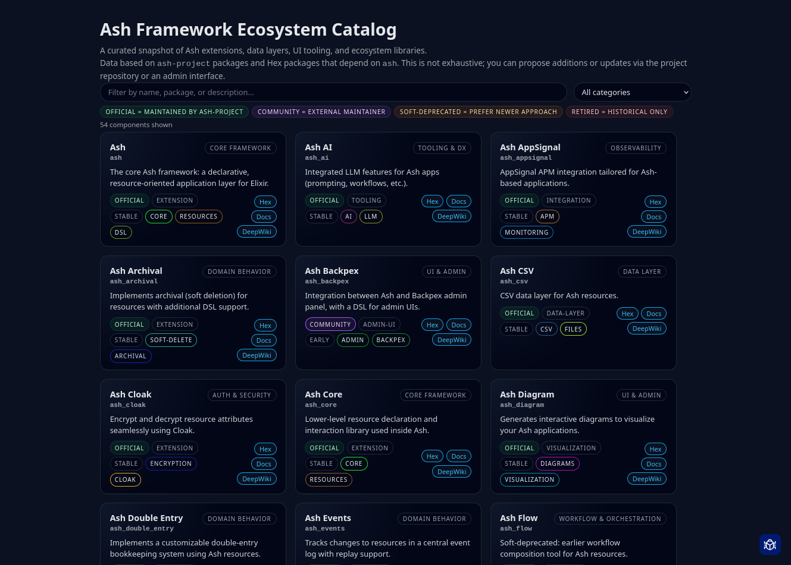
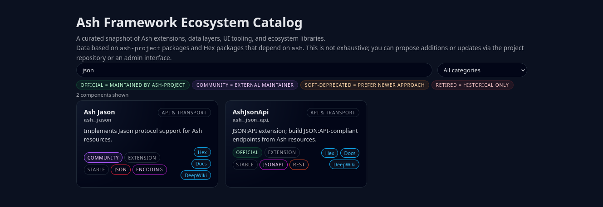
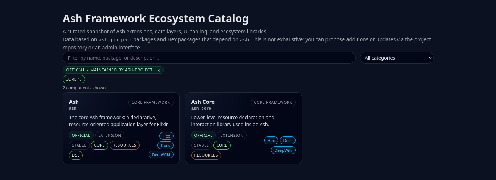
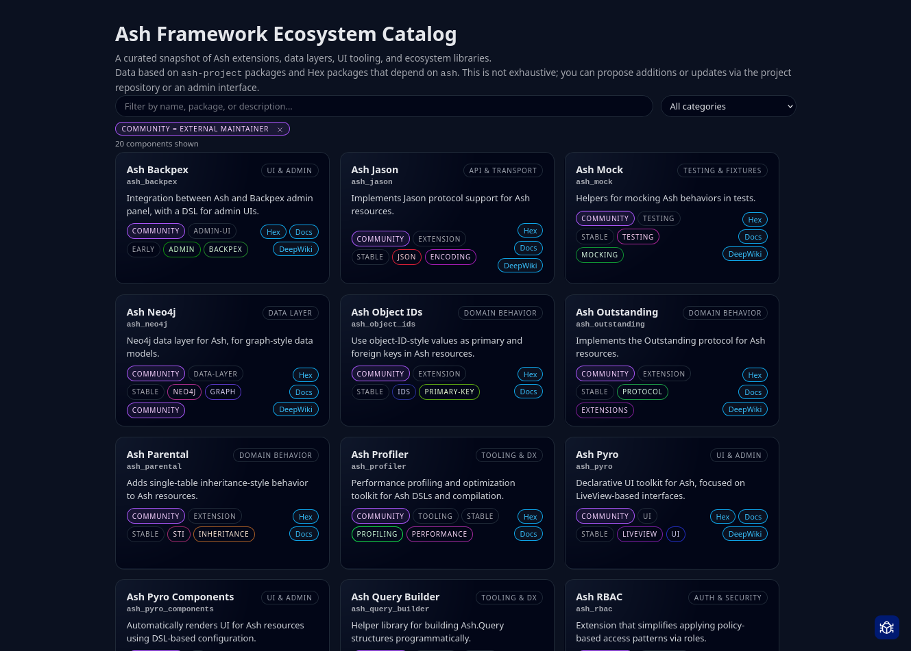

Ashes (Ecosystem Catalog)

This repository contains a Phoenix LiveView application that provides a browsable catalog of packages and extensions related to the Ash framework.

What it contains

- A LiveView web UI for browsing package entries (lib/ashes_web/live/packages_live.ex and lib/ashes_web/live/packages_live.html.heex).
- Ash resources that model packages, tags, and package-tags and a SQLite data layer (lib/ecosystem/packages.ex and lib/ecosystem/packages).
- Components used to render package cards and status chips (lib/ashes_web/components).
- Seed data and migrations that populate the database with example entries (priv/repo/migrations and priv/repo/seeds.exs).

What it does

- Lists packages with metadata such as name, package handle, category, tags, description, status, and links to docs/hex and DeepWiki.
- Server-side filtering by category, status, and tags.
- A search box that performs server-side text search across name, package, description, and tags. Results update live as you type.
- Publishes notifications for package create/update/destroy events and refreshes the UI when changes occur.

What it is not

- Not a packaged library. This is an application repository intended to be read, run, and (optionally) extended.
- Not an exhaustive or authoritative registry of Ash packages; the app uses seeded data and local storage.

Preview

Below are previews of the UI (the original image files are in screenshots/):

All packages — the full catalog view showing all entries.

Search results — a search term applied to show matching packages.

By category — the catalog filtered by a selected category.

By tags — the catalog filtered by one or more tags.

Community filter — results restricted to community-maintained packages.

Running locally

- Requires Elixir and Erlang/OTP versions appropriate for the project (see mix.exs).
- Install dependencies and setup the DB with `mix setup`.
- Start the app with `mix phx.server` and visit http://localhost:4000 (or the port configured in your environment).
